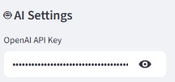
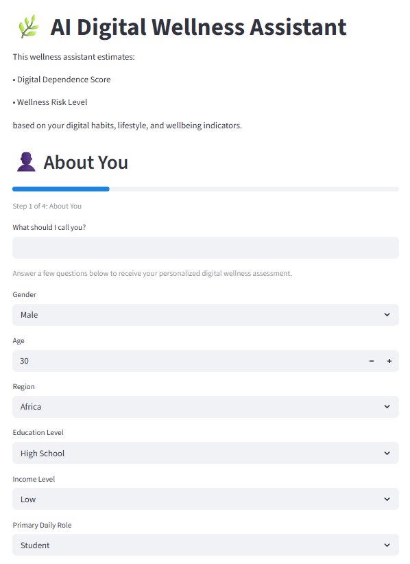
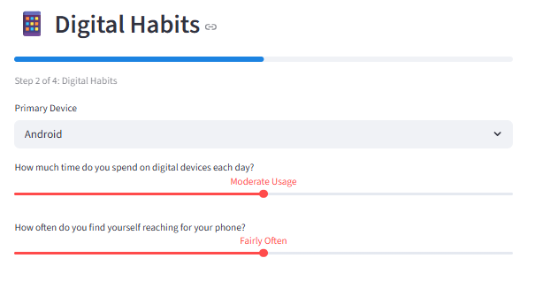
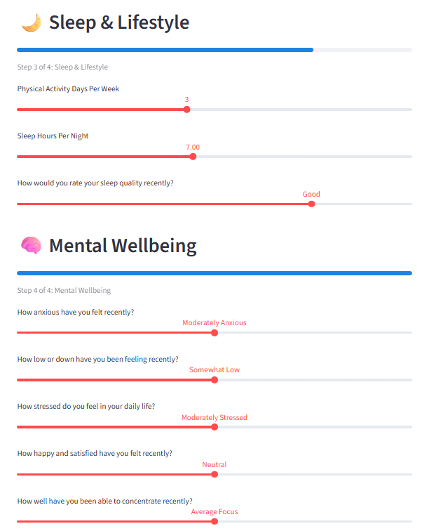
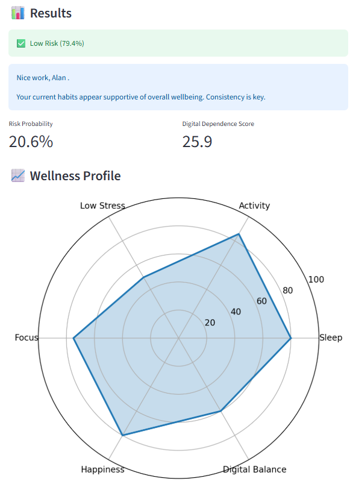
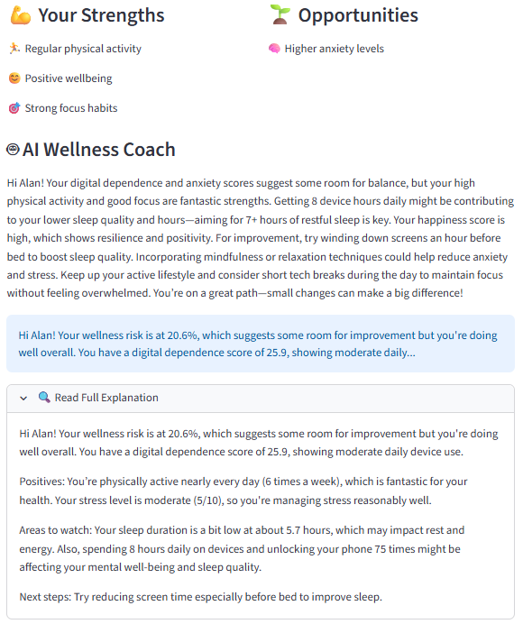
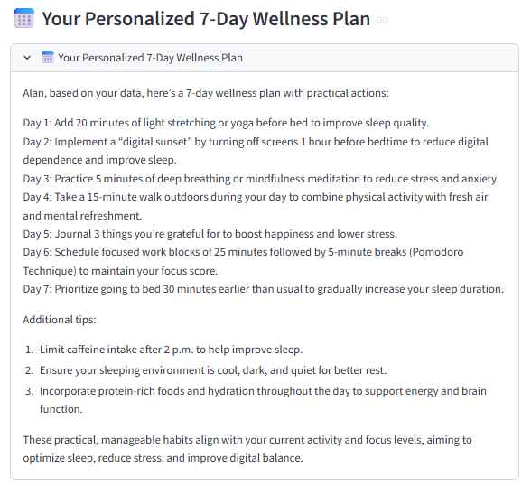
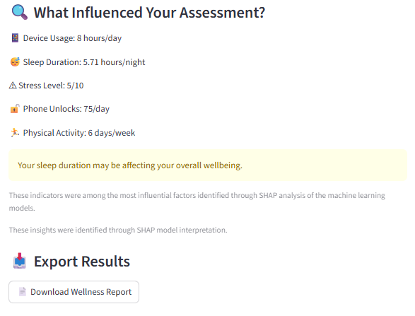
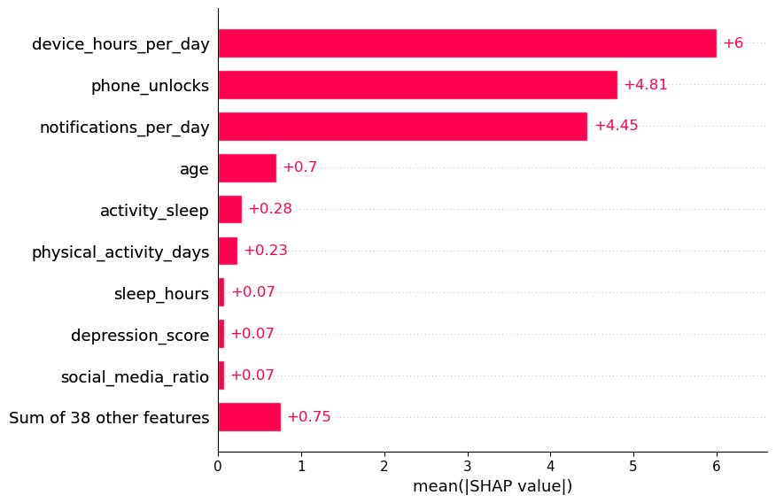
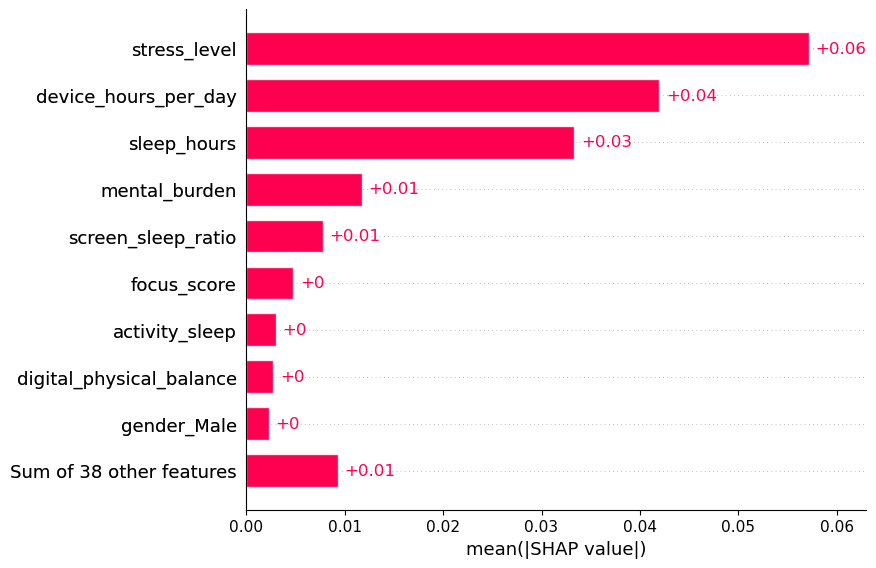

# 🌿AI-Powered Digital Wellness Assistant
The AI-Powered Digital Wellness Assistant is an end-to-end Machine Learning and Generative AI application that helps users better understand their digital habits, wellbeing patterns, and potential wellness risks.

The application combines:

- Machine Learning (Classification & Regression)
- SHAP Explainability
- Large Language Models (OpenAI)
- Personalized Wellness Recommendations
- Interactive Streamlit Dashboard

to transform behavioural and wellbeing indicators into actionable wellness insights.

## Application Preview 

### User Assessment 

* Enter OpenAI API Key



* Answer questions

<p align="center">
  
  
  
</p>

### Wellness Dashboard



### AI Wellness Coach 



### Personalized Wellness Plan 





## Key Features

### 📊 Machine Learning Predictions

The application predicts:

- **Wellness Risk Level** (Classification)
- **Digital Dependence Score** (Regression)

using demographic, behavioural, lifestyle, and wellbeing indicators.

### 🔍 Explainable AI

Model decisions are interpreted using **SHAP (SHapley Additive Explanations)**.

Users receive transparent insights into the factors that most strongly influence their assessment.

### 🤖 LLM-Powered Explanation Layer

OpenAI models are used to:

- Explain predictions in plain language
- Translate technical insights into user-friendly feedback
- Highlight strengths and opportunities
- Provide practical wellness recommendations

### 📅 Generative AI Wellness Planning

The application generates:

- Personalized wellness summaries
- Behaviour improvement suggestions
- Customized 7-day wellness plans

tailored to each user's profile.

### 📈 Interactive Dashboard

Includes:

- Wellness metrics
- Radar chart visualization
- Strengths & opportunities analysis
- AI coaching feedback
- Downloadable wellness reports

---

## Application Workflow

```text
User Inputs
      ↓
Feature Engineering
      ↓
Machine Learning Models
(AdaBoost + Linear Regression)
      ↓
SHAP Explainability
      ↓
LLM Explanation Layer
      ↓
Generative AI Wellness Coach
      ↓
Personalized Wellness Dashboard
```

---

# 🎯Objectives
The project focuses on three target variables from the dataset:

## Classification Target
### High Risk Flag

Predict whether a user belongs to a high-risk wellness category based on: 

* Digital behaviour
* Lifestyle habits
* Mental well-being indicators
* Demographic information

## Regression Targets
### Digital Dependence Score
Estimate a user's level of digital dependence using behavioural and well-being indicators.

### Productivity Score
Predict overall productivity levels.

Although multiple models were evaluated, the dataset contained weak predictive signals for productivity score, resulting in limited perspective performance compared to the other two targets. 


# 🧠Machine Learning Workflow 

## 1. Exploratory Data Analysis

Performed exploratory analysis to: 

* Understand feature distributions
* Identify relationships between variables
* Examine correlations
* Detect potential data leakage

Tools:
* Pandas
* Matplotlib
* Seaborn

## 2. Data Pre-processing

#### Handing Categorical Variables
Used one-hot encoding:

```py
pd.get_dummies()
```

for:
* Gender
* Region
* Education Level
* Income Level
* Daily Role
* Device Type

#### Scaling
Applied:
```py
StandardScaler()
```
for models sensitive to feature scale:
* Logistic Regression
* KNN 
* Linear Regression

#### Train/Test Split

Classification:
```py
train_test_split(stratify = y)
```

Regression:
```py
train_test_split()
```

# Feature Engineering 

Several engineered features were created to improve predictive performance:

|Feature|Description|
|-------|-----------|
|screen_sleep_ratio|Device hours relative to sleep duration|
|social_media_ratio|Social media usage proportion|
|notifications_per_hour|Notification intensity
|mental_burden|Combined anxiety, depression, and stress indicator|
|wellbeing_index|Combined happiness, focus, and sleep quality|
|digital_physical_balance|Digital activity versus physical activity|
|activity_sleep|Interaction between activity and sleep|


# Models Evaluated

## Classification Models
* Logistic Regression
* K-Nearest Neighbours (KNN)
* XGBoost Classifier
* Random Forest Classifier
* AdaBoost Classifier
* Gradient Boosting Classifier

## Regression Models 
* Linear Regression
* KNN Regressor
* XGBoost Regressor
* Random Forest Regressor
* AdaBoost Regressor
* Gradient Boosting Regressor

# Model Performance

## AdaBoost Classifier (For high_risk_flag)

| Metric | Score |
|----------|----------|
| Accuracy | 0.883 |
| Precision | 0.82 |
| Recall | 0.54 |
| F1 Score | 0.65 |
| ROC-AUC | 0.782 |

## Linear Regression (for digital_dependence_score)

| Metric | Score |
|----------|----------|
| MAE | 0.708 |
| RMSE | 1.70 |
| R² | 0.986 |

# Hyperparameter Tuning 
Performed optimization using: 
```py
RandomizedSearchCV
```

Parameters tuned included:
* n_estimators
* learning_rate
* max_depth
* min-samples_split
* colsample_bytree
* max_features

depending on the model.

# Evaluation Metrics

|Classification|Regression|
|--------------|----------|
|Accuracy|MAE (Mean Absolute Error)|
|Precision| MSE (Mean Squared Error)|
|Recall|RMSE (Root Mean Squared Error)|
|F1-Score|R² Score|
|ROC-AUC||

# Model Explainability (SHAP)

To improve transparency, SHAP (SHapley Additive Explanations) was used to identify which features had the greatest influence on each prediction task.

## Digital Dependence Score Prediction

The SHAP analysis revealed that digital behavior variables were the strongest drivers of the predicted dependence score.

Key factors included:
* Device Hours Per Day
* Phone Unlock Frequency
* Notifications Per Day
* Age
* Activity-Sleep Balance

These findings suggest that the intensity and frequency of device interaction play a major role in determining digital dependence levels.

<p align="center">  </p>

## Wellness Risk Prediction 
For wellness risk classification, lifestyle and wellbeing indicators were more influential than simple usage metrics.

The most important factors included:
* Stress Level
* Device Hours Per Day
* Sleep Hours
* Mental Burden
* Screen-to-Sleep Ratio

The results indicate that elevated stress and insufficient sleep contribute more strongly to wellness risk than digital behavior alone.
 <p align="center">  </p>


The two predictive models capture different dimensions of digital wellbeing:

| Digital Dependence Score | Wellness Risk Prediction |
|--------------------------|--------------------------|
| Focuses on device interaction patterns | Focuses on wellbeing and lifestyle indicators |
| Driven by usage intensity and engagement | Driven by stress, sleep, and mental burden |
| Measures behavioural dependence | Measures potential wellness impact |

Together, the models provide a more comprehensive assessment of both digital behaviour and overall wellbeing.

# Large Language Model (LLM) Explanation Layer

Machine learning predictions can be difficult for non-technical users to understand. To improve transparency and usability, OpenAI language models are used to translate model outputs into human-readable explanations. 
### Inputs
The LLM receives: 
* High Risk Probability
* Digital Dependence Score
* Key well-being indicators
* SHAP-identified important features
* User-specific feature values
### Outputs
The LLM generates:
* Plain-language interpretation of results
* Identification of positive habits
* Areas that may deserve attention
* Personalized recommendations

# Generative AI Wellness Coach 
Beyond explaining predictions, the application uses Generative AI to provide personalized wellness guidance tailored to each user's digital habits and well-being profile.

### Inputs
The model considers:
* Risk probability
* Digital dependence score 
* Sleep duration and quality
* Physical activity levels
* Stress and anxiety indicators
* Happiness and focus scores
### Outputs
The Generative AI Wellness Coach produces:

### Wellness Summary
* Friendly and supportive feedback
* Positive observations
* Areas for improvement
* Practical suggestions

### Personalized 7-Day Wellness Plan

The assistant generates a customized action plan including:

* Daily wellbeing activities
* Sleep improvement strategies
* Digital wellbeing recommendations
* Stress management techniques
* Physical activity goals

# Streamlit User Interface

Features include:

- Interactive assessment form
- Human-friendly wellness inputs
- Radar chart visualization
- Strengths and opportunities analysis
- AI wellness coaching
- Personalized action plans
- Downloadable wellness reports

## Installation

Clone the repository:

```bash
git clone https://github.com/yourusername/ai-powered-digital-wellness-assistant.git
cd ai-powered-digital-wellness-assistant
```

Install dependencies:

```bash
pip install -r requirements.txt
```

Launch the application:

```bash
streamlit run app_openai.py
```

---

## OpenAI Setup

To enable AI-powered explanations and wellness plans:

1. Generate an OpenAI API key
2. Launch the application
3. Paste the API key into the sidebar

Without an API key:

- Machine learning predictions remain available
- AI explanations and wellness plans will not be generated


# Technologies Used 

### Data Science & Machine Learning

- Python
- Pandas
- NumPy
- Scikit-Learn

### Explainable AI

- SHAP

### Visualization

- Matplotlib

### Application Development

- Streamlit

### Generative AI

- OpenAI API


# Project Structure

```py
AI-Digital-Wellness-Assistant/

│
├── notebooks/
│   ├── notebook_ml.ipynb
│
├── models/
│   ├── high_risk_classifier.pkl
│   ├── digital_dependence_regressor.pkl
│   ├── digital_dependence_scaler.pkl
│   └── model_columns.pkl
│
├── images/
│
├── app.py
│
├── requirements.txt
│
└── README.md
```
# Challenges Learned

Key lessons from this project included:

- Feature engineering often improved performance more than changing algorithms.
- Explainability was essential for translating model outputs into actionable insights.
- Integrating Large Language Models significantly improved the user experience by converting technical predictions into understandable recommendations.
- Product design and usability became increasingly important as the application evolved from a machine learning prototype into an interactive wellness tool.


# Future Improvements

Potential future enhancements include:

- User-specific SHAP explanations
- Historical wellness tracking
- RAG-powered evidence-based wellness recommendations
- Mobile-first deployment
- Multi-language support
- User account and progress monitoring
