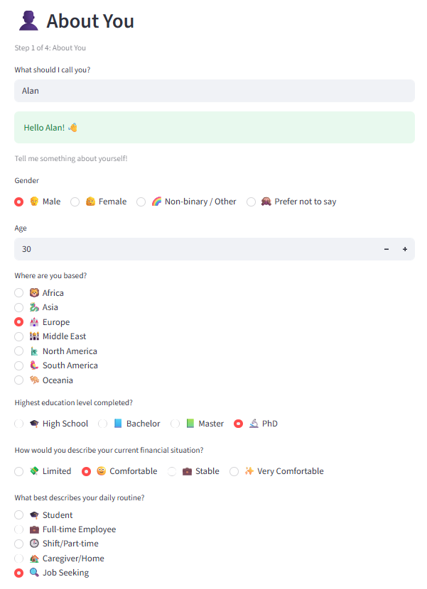
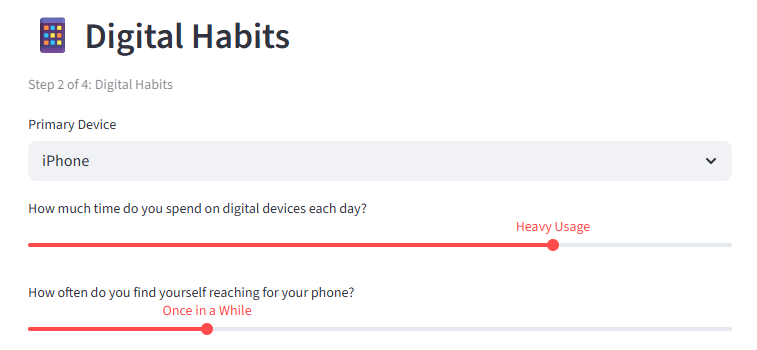
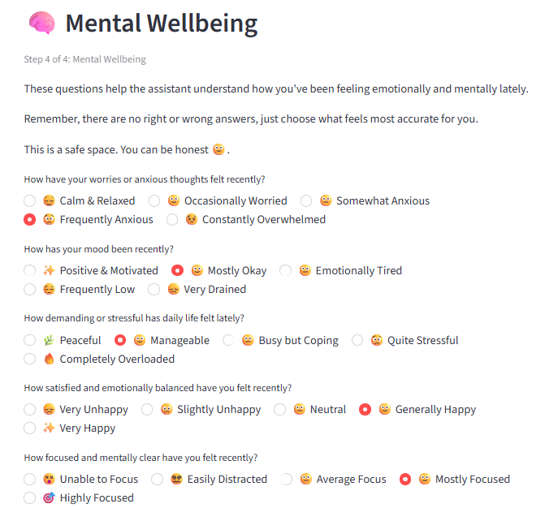
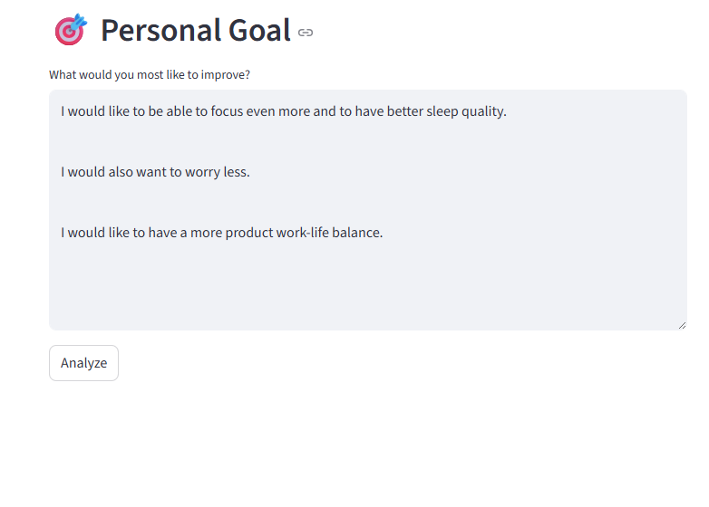
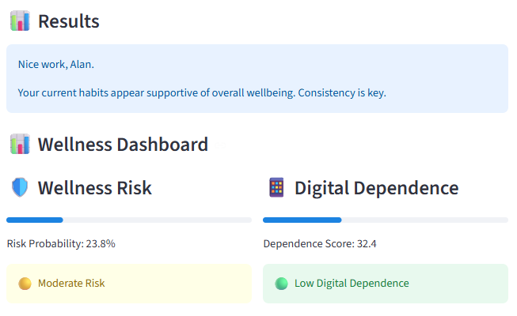
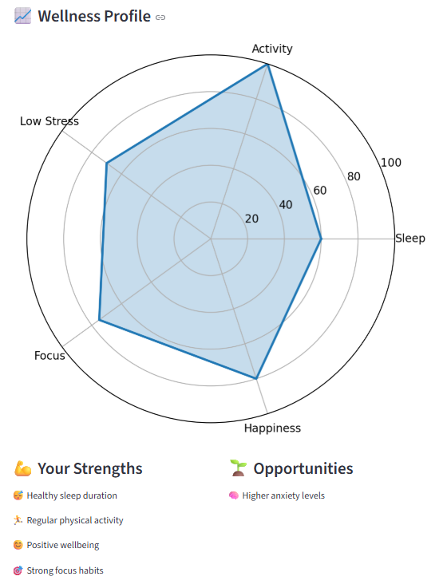
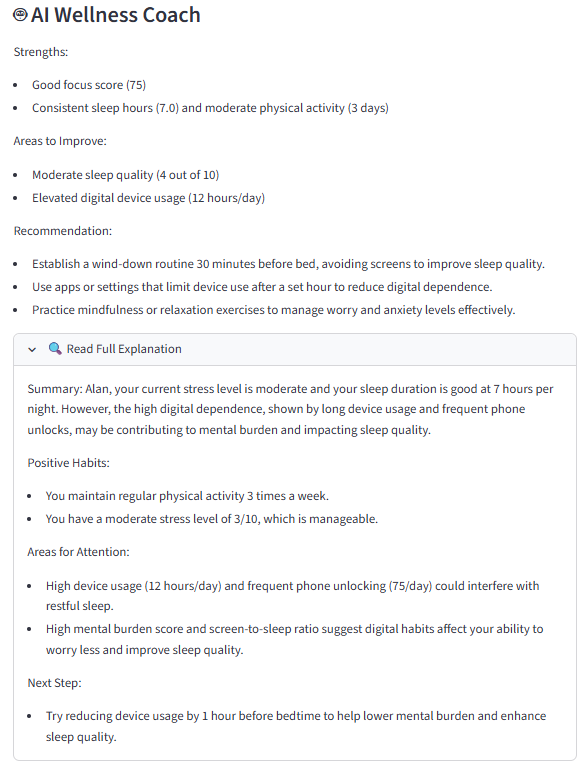
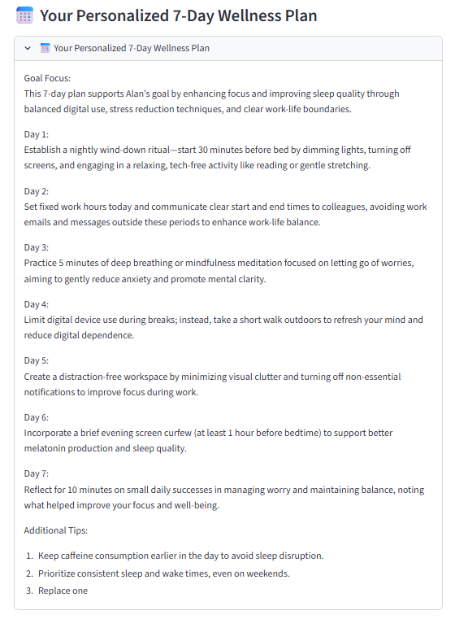

# 🌿AI-Powered Digital Wellness Assistant
The AI-Powered Digital Wellness Assistant is an end-to-end Machine Learning and Generative AI application that helps users better understand their digital habits, wellbeing patterns, and potential wellness risks.

The application combines:

- Machine Learning (Classification & Regression)
- SHAP Explainability
- Large Language Models (OpenAI)
- Personalized Wellness Recommendations

Built with Streamlit, Scikit_Learn, SHAP, and OpenAI. 

# 📊 Data Source 

This project utilizes the Digital Lifestyle Benchmark Dataset (2025) published on Hugging Face by Tarek Masryo.

https://huggingface.co/datasets/tarekmasryo/digital-lifestyle-benchmark-dataset


# ✨ Key Features
* 📊 Wellness Risk Prediction
* 📱 Digital Dependence Scoring
* 🔍 SHAP Explainability
* 🤖 LLM-Powered AI Coaching
* 📅 Personalized 7-Day Wellness Plans
* 📈 Interactive Wellness Dashboard
* 📄 Downloadable Wellness Reports


# 🖥️ Application Preview 

## Wellness Assessment 

Users provide demographic information, digital habits, sleep and lifestyle behaviours, and mental wellbeing indicators through an interactive assessment form.

Users can specify a personal improvement goal (e.g., sleep quality, stress reduction, focus, or exercise). The AI incorporates this goal into explanations and personalized recommendations.

<p align="center">
  
  
</p>

<p align="center">
  
  
</p>

### Personalized Results Dashboard 

The dashboard presents predicted wellness risk and digital dependence levels using intuitive visual indicators.

<p align="center">
  
</p>

### Wellness Profile Visualization 

A radar chart summarizes key wellness dimensions including sleep, activity, stress management, focus, and happiness.

<p align="center">
  
</p>

### Explainable AI & Personalized Coaching

Model explanations are informed by SHAP feature importance analysis and translated into user-friendly insights through OpenAI-powered explanations.

<p align="center">
  
</p>

### Generative AI Wellness Planning
The system generates a personalized 7-day wellness improvement plan that incorporates the user's behavioural patterns and stated improvement goals.
<p align="center">
  
</p>

# 🧠 AI Architecture

```py
User Inputs
      ↓
Feature Engineering
      ↓
Machine Learning Models
(AdaBoost + Linear Regression)
      ↓
SHAP Explainability
      ↓
LLM Explanation Layer
      ↓
Generative AI Wellness Coach
      ↓
Personalized Dashboard
```

# 📊 Machine Learning 

## Classification Target
* Wellness Risk Prediction 

## Regression Target
* Digital Dependence Score 

## Model Evaluated 
### Classification
* Logistic Regression
* KNN
* Random Forest
* XGBoost
* AdaBoost
* Gradient Boosting
### Regression
* Linear Regression
* KNN Regressor
* Random Forest Regressor
* XGBoost Regressor
* AdaBoost Regressor
* Gradient Boosting Regressor

### Final Models

|**Task**|**Model**|
|----|-----|
|Wellness Risk|AdaBoost Classifier|
|Digital Dependence|Linear Regression|


# 🔍 Explainable AI (SHAP)

SHAP (SHapley Additive Explanations) analysis was used to identify which behavioural and wellbeing indicators most strongly influenced predictions.

## Digital Dependence Drivers
* Device Hours Per Day
* Phone Unlock Frequency
* Notifications Per Day

## Wellness Risk Drivers
* Stress Level 
* Sleep Hours
* Mental Burden
* Screen-to-Sleep Ratio 


# 🤖 LLM & Generative AI Layer

OpenAI models are used to:

* Translate predictions into user-freindly explanations
* Highlight strengths and improvement areas
* Generate personalized wellness recommendations
* Create customized 7-day wellness plans

# 🛠️ Technologies Used

## Machine Learning
* Scikit-Learn
* Pandas
* NumPy

## Explainability 
* SHAP

* Application Development
* Streamlit

## Generative AI
* OpenAI API

## Visualization
* Matplotlib

# 🚀 Installation

Clone the repository:

```bash
git clone https://github.com/alananjungwei/ai-powered-digital-wellness-assistant.git
cd ai-powered-digital-wellness-assistant
```

Install dependencies:

```bash
pip install -r requirements.txt
```

Launch the application:

```bash
streamlit run app.py
```

# Future Improvements
* Real-time SHAP explanations
* Historical wellness tracking
* Mobile-first UI
* Multi-language support
* RAG-powered recommendations


